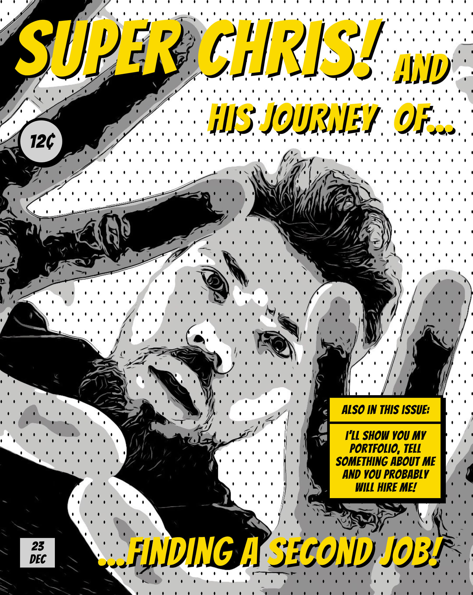
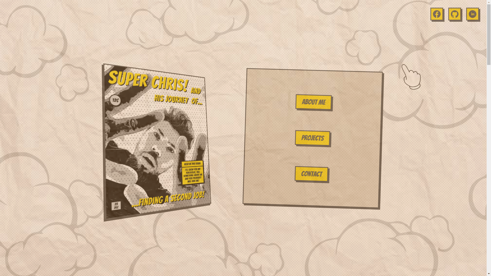
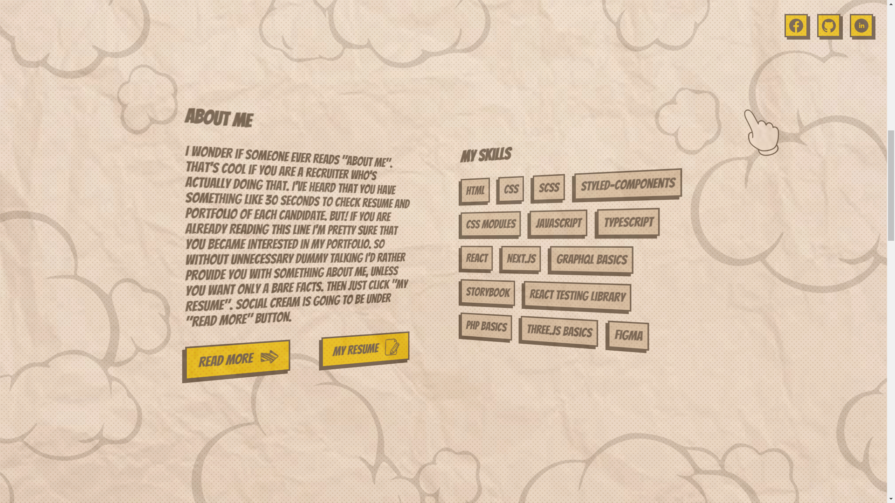
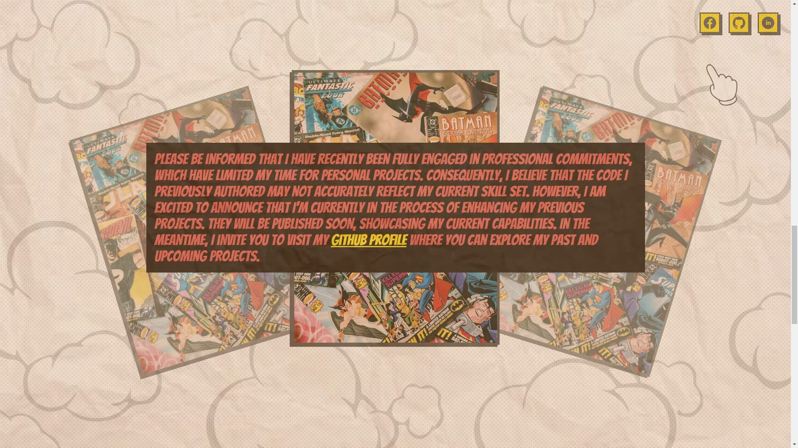
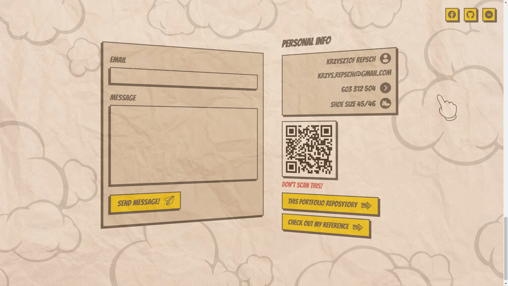

<br />
<br />

# Krzysztof Repsch - My Portfolio 🤟

https://portfoliorepsch.netlify.app/

<br />

### About Project

Hi! My name is Chris and this is my portfolio. The most important thing for me was to make it look different than the others. I've tried to make it look like a comic book, so let me know what you think! 😉

<br />

## Used Technologies

Checkout devDependencies & dependencies:
https://github.com/BlackAndWhiteCarnage/MyPortfolio/blob/develop/package.json

<br />

## Features

- Some things look like 3D (idk how to call it, you shoud see it)
- Projects slider
- Sending email
- Form validation with react-hook-form
- Custom cursor
- Stories
- A bit of humor 😅

<br />

## How to run?

1. Clone the project

```bash
  git clone https://github.com/BlackAndWhiteCarnage/MyPortfolio.git
```

2. Install dependencies

```bash
  npm install
```

3. Run project

```bash
  npm start
```

## How to run storybook?

1. After previous steps

```bash
  npm run storybook
```

<br />

## Quick Preview

### Home



### About Me



### Projects (empty for now, read info from screenshot 😔)



### Contact



<br />

## Author

- [@BlackAndWhiteCarnage](https://github.com/BlackAndWhiteCarnage)
